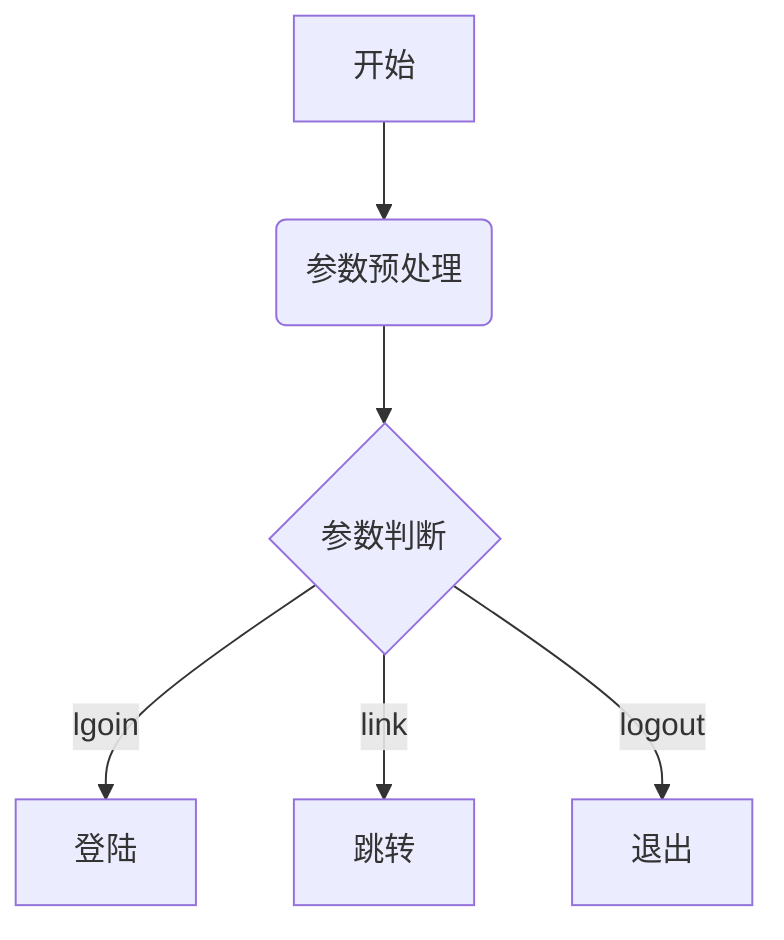
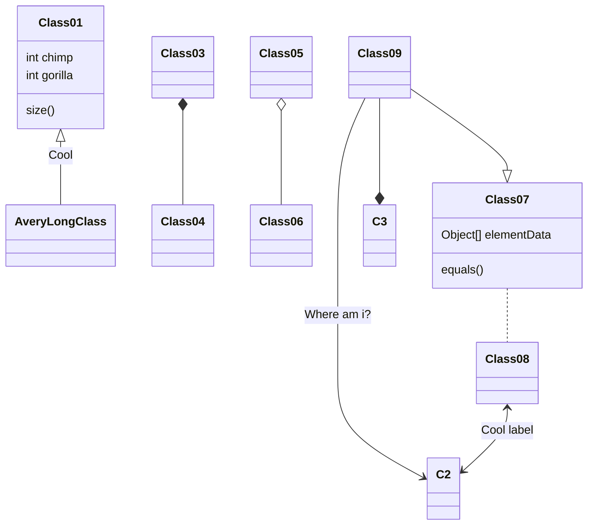

# 欢迎使用kodMarkdown编辑器

[TOC]


我们理解您需要更便捷更高效的工具记录思想，整理笔记、知识，并将其中承载的价值传播给他人，*kodMarkdown** 是我们给出的答案 —— 我们为记录思想和分享知识提供更专业的工具。 您可以用来：

> * 整理知识，学习笔记
> * 发布日记，杂文，所见所想
> * 撰写发布技术文稿（代码支持）
> * 撰写发布学术论文（LaTeX 公式支持）


------

## 什么是 Markdown

Markdown 是一种方便记忆、书写的纯文本标记语言，用户可以使用这些标记符号以最小的输入代价生成极富表现力的文档：譬如您正在阅读的这份文档。它使用简单的符号标记不同的标题，分割不同的段落，**粗体** 或者 *斜体* 某些文字，更棒的是，它还可以

### 1. 制作一份待办事宜

- 支持以 PDF 格式导出文稿
- 改进 Cmd 渲染算法，使用局部渲染技术提高渲染效率
- 新增 Todo 列表功能
- 修复 LaTex 公式渲染问题
- 新增 LaTex 公式编号功能

### 2. 书写一个公式
**参考资料**: 
 1. [在线工具](http://tool.oschina.net/js/mathml/index.html)
 2. [公式语法速查](http://xiang.leanote.com/post/introduction-to-mathjax-and-latex-expression)
 3. [LaTex说明](https://khan.github.io/KaTeX/function-support.html)

$$E=mc^2$$

多行公式
```math
\displaystyle 
    \frac{1}{
        \Bigl(\sqrt{\phi \sqrt{5}}-\phi\Bigr) e^{
        \frac25 \pi}} = 1+\frac{e^{-2\pi}} {1+\frac{e^{-4\pi}} {
        1+\frac{e^{-6\pi}}
        {1+\frac{e^{-8\pi}}
         {1+\cdots} }
        } 
    }
```

### 3. 高亮一段代码

三撇开始和结束；可以指定编程语言
```php
/**
 * 创建目录
 *
 * @param string $dir
 * @param int $mode
 * @return bool
 */
function mk_dir($dir, $mode = 0777){
	if (!$dir) return false;
	if (is_dir($dir) || @mkdir($dir, $mode)){
		return true;
	}
	if (!mk_dir(dirname($dir), $mode)){
		return false;
	}
	return @mkdir($dir, $mode);
}
```

### 4. 高效绘制流程图
**绘图说明**: [流程图 | 时序图 | 甘特图 | 类图](http://blog.csdn.net/wangyaninglm/article/details/52887045)


### 5. 高效绘制时序图

```seq
Alice->Bob: Hello Bob, how are you?
Note right of Bob: Bob thinks
Bob-->Alice: I am good thanks!
```

### 6. 高效绘制甘特图
```gantt
title 项目开发流程
section 项目确定
  需求分析       :a1, 2016-06-22, 3d
  可行性报告     :after a1, 5d
  概念验证       : 5d
section 项目实施
  概要设计      :2016-07-05  , 5d
  详细设计      :2016-07-08, 10d
  编码          :2016-07-15, 10d
  测试          :2016-07-22, 5d
section 发布验收
  发布: 2d
  验收: 3d
```

```
sequenceDiagram
participant Alice
participant Bob
Alice->>John: Hello John, how are you?
loop Healthcheck
  John->>John: Fight against hypochondria
end
Note right of John: Rational thoughts<br/>prevail...
John-->>Alice: Great!
John->>Bob: How about you?
Bob-->>John: Jolly good!
```

UML 类图



### 7. 绘制表格

| 项目        | 价格   |  数量  |
| --------   | -----:  | :----:  |
| 计算机     | \$1600 |   5     |
| 手机        |   \$12   |   12   |
| 管线        |    \$1    |  234  |

### 8. 更详细语法说明

基础示例

**加粗文本**
*斜体文本*
~~删除线~~

----

有序列表
 1. 第一步
 2. 第二步
 3. 第三步


无序列表
 - 第一步
 - 第二步
 - 第三步

超链接
   [豆瓣](http://douban.com)
   [知乎](http://zhihu.com)


总而言之，不同于其它 *所见即所得* 的编辑器：你只需使用键盘专注于书写文本内容，就可以生成印刷级的排版格式，省却在键盘和工具栏之间来回切换，调整内容和格式的麻烦。**Markdown 在流畅的书写和印刷级的阅读体验之间找到了平衡。** 目前它已经成为世界上最大的技术分享网站 GitHub 和 技术问答网站 StackOverFlow 的御用书写格式。


### KaTeX vs MathJax
[https://jsperf.com/katex-vs-mathjax](https://jsperf.com/katex-vs-mathjax "KaTeX vs MathJax")
